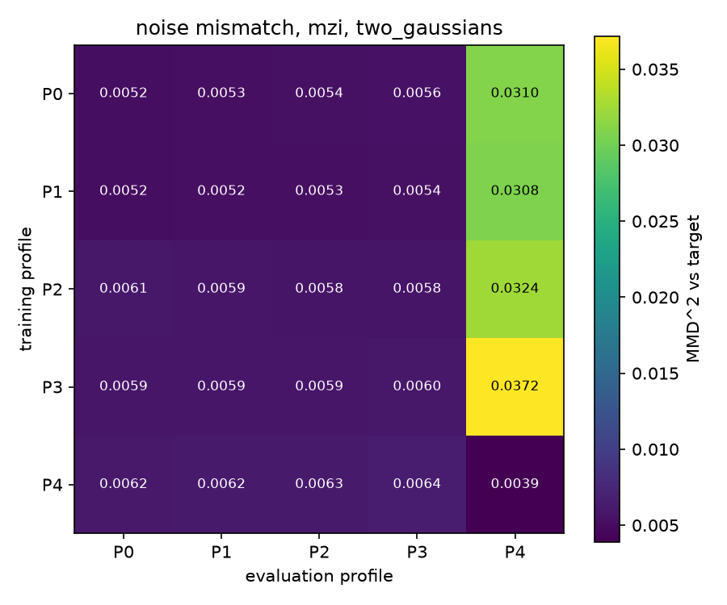
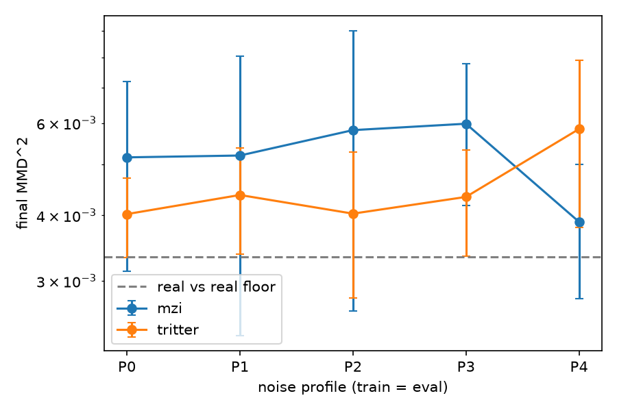

# Hybrid Photonic Generative Models

**MZI vs tritter meshes under realistic photonic noise.**

Student research project by **Hugo**, **Niels** and **Tony**.

## Research question

We build a hybrid classical–quantum generative model: a classical PyTorch network
coupled to a differentiable photonic quantum layer through
[MerLin](https://github.com/merlinquantum/merlin) (Quandela's QML layer on top of
[Perceval](https://perceval.quandela.net/)), trained end-to-end with an MMD
(Maximum Mean Discrepancy) loss.

The question we answer:

> At a comparable trainable-parameter budget, do an **MZI mesh** (Clements
> decomposition) and a **tritter mesh** (3×3 DFT mixers) have the same generative
> expressivity — and does the **ranking between the two survive realistic photonic
> noise** (partially distinguishable photons, losses) **and noise mismatch**
> (training noise ≠ deployment noise)?

This is **not** a quantum-advantage claim. It is a characterization study, and a
flat result (the ranking does not move under noise) is a result we will report
honestly.

A full pedagogical explanation of the project (linear optics from scratch, Fock
states, HOM interference, the MMD loss, the API traps) lives in the companion
LaTeX document (`quantum_project_explanation/`).

## Repository structure

```
.
├── docs/                 # OFFLINE_KIT.md: validated API survival guide (every snippet
│   └── exercises/        #   executed on the pinned stack) + 6 crash-test exercises
├── src/                  # Python modules (Phase 1+: data.py, model.py, losses.py,
│                         #   train.py, eval.py, noise.py, mismatch_matrix.py, ...)
├── notebooks/            # Reproducible notebooks (interpretation in Markdown cells)
├── figures/              # Key result figures, versioned (mismatch heatmap, MMD curves, ...)
├── data/                 # Local datasets (gitignored)
├── results/              # Weights, logs, CSV/JSON metrics (gitignored, reproduced)
├── Dockerfile            # Reproducible environment (Python 3.12 + pinned quantum stack)
├── compose.yaml          # One-command JupyterLab via Podman/Docker
└── requirements.txt      # Pinned: perceval-quandela==1.2.4, merlinquantum==0.4.0
```

## The environment: why a container

The whole team must run **exactly** Python 3.12, Perceval 1.2.4 and MerLin 0.4.0:
the API traps we documented (output-space switching under noise, state_dict
incompatibilities with losses, builder vs circuit constructor) were validated on
these versions, and a silent version bump on one machine would make results
non-comparable between us. The container guarantees the three of us — and anyone
reproducing the repo — run the same environment, on Windows, macOS or Linux.

We use **Podman** (free, open source, daemonless, rootless; drop-in compatible
with Docker — every command below also works with `docker` instead of `podman`).
The simulation is CPU-bound, so no GPU passthrough is needed.

## Working with Podman, step by step

### 0. Install Podman (once)

- **Windows / macOS**: install [Podman Desktop](https://podman-desktop.io/) (or
  `winget install RedHat.Podman` / `brew install podman`).
- **Linux**: `sudo apt install podman` (Debian/Ubuntu) or `sudo dnf install podman` (Fedora).

On Windows and macOS, Podman runs containers inside a small VM. Create and start
it once:

```bash
podman machine init
podman machine start
```

(After a reboot, only `podman machine start` is needed. On Linux, skip this step.)

Check that everything works:

```bash
podman --version
podman run --rm docker.io/library/hello-world
```

### 1. Build the image (once, and after each requirements.txt change)

From the repository root:

```bash
podman build -t photonic-gen .
```

First build downloads ~1 GB (Python base image + CPU torch + quantum stack);
subsequent builds reuse the cache and are fast.

### 2. Daily work: JupyterLab

```bash
podman compose up
```

Then open **http://localhost:8888** in your browser. The repository is
live-mounted into the container: any file you edit on your machine (in your IDE)
is immediately visible inside, and notebooks you save land back in `notebooks/`
on your disk. Stop with `Ctrl+C` (or `podman compose down`).

> If `podman compose` complains about a missing compose provider, install one:
> `pip install podman-compose`, then re-run.

### 3. Running a script (training, evaluation)

Without starting Jupyter:

```bash
podman compose run --rm lab python src/train.py
```

Or open an interactive shell inside the environment:

```bash
podman compose run --rm lab bash
# then inside: python src/train.py, pip list, etc.
```

If JupyterLab is already running and you want a second shell in the *same*
container:

```bash
podman exec -it $(podman ps -q --filter ancestor=photonic-gen) bash
```

### 4. Changing dependencies

1. Edit `requirements.txt` (never bump `perceval-quandela` or `merlinquantum`
   without a team decision — the API traps were validated on the pinned versions).
2. Rebuild: `podman compose build` (or `podman build -t photonic-gen .`).
3. Commit `requirements.txt` so the others rebuild too.

### 5. Quandela Cloud token (Phase 4 only)

Create a `.env` file at the repo root (gitignored):

```
QUANDELA_TOKEN=your_token_here
```

`compose.yaml` forwards it into the container as an environment variable. Never
commit a token.

### Troubleshooting

| Symptom | Fix |
|---|---|
| `Cannot connect to Podman` / `connection refused` | The VM is not running: `podman machine start`. |
| `permission denied` on mounted files (Fedora/RHEL) | SELinux labeling: change the volume in `compose.yaml` to `.:/app:Z`. |
| Port 8888 already in use | Change the mapping in `compose.yaml`, e.g. `127.0.0.1:8889:8888`. |
| A pip package fails to build during `podman build` | Add `build-essential` to the image: `RUN apt-get update && apt-get install -y build-essential` before the pip lines. |
| Build fails with `CERTIFICATE_VERIFY_FAILED` on pypi.org / download.pytorch.org | Your network intercepts TLS (antivirus/proxy). Create a local `.env` at the repo root containing `PIP_TRUST_INDEX_HOSTS=1`, then rebuild. This skips certificate verification for the package indexes during the build only — do not commit it. |
| You have Docker instead of Podman | Every command works verbatim with `docker`: `docker build`, `docker compose up`, ... |

### Fallback without a container

Not recommended (environment drift is exactly what we are trying to avoid), but
possible:

```bash
python3.12 -m venv .venv
. .venv/bin/activate            # Windows: .venv\Scripts\activate
pip install torch==2.5.1
pip install -r requirements.txt
```

## Project conventions (binding for humans and AI assistants)

- **Every `QuantumLayer` forces the full Fock space**:
  `MeasurementStrategy.probs(ComputationSpace.FOCK)` — even in the noiseless
  case. Non-negotiable: noise silently changes the output dimension otherwise.
- Weight transfer between noise profiles goes through `copy_circuit_params`
  (trainable phases only), never through a full `state_dict` load.
- Code comments in English; no decorative prints (logging goes to CSV/JSON).
- Fixed seeds in every script that produces a result.
- Existing code from a teammate is extended, not modified.
- Interpretation lives in notebook Markdown cells, not code comments.

## Roadmap

| Phase | Content | Owner |
|---|---|---|
| 1 | Minimal generator learning 2D synthetic targets (MMD) | Hugo |
| 1bis | Financial log-returns target (fat tails) | Hugo |
| 2 | Noise pipeline + train/deploy mismatch matrix (P0–P4) | Hugo |
| 3 | MZI vs tritter comparison at fair parameter budget | Niels, Tony + Hugo |
| 4 | Inference on Quandela Cloud (Belenos/Lucy), sim-vs-hardware gap | Niels, Tony + Hugo |
| 5 | Reproducible artifact (this repo) | all |

**Status (July 2026):** phases 1, 1bis, 2 and 3 are complete in simulation
(results below); phase 4 is pending Quandela Cloud access.

## Results (simulation, July 2026)

Full interpretation in `notebooks/results_noise_and_meshes.ipynb`. Seed 0,
6 modes, 3 photons, `two_gaussians` target, 800 steps, batch 256; the
real-vs-real MMD floor is 0.0033 ± 0.0013.

**Noise mismatch (phase 2).** Partial distinguishability barely moves the
matched-profile MMD (0.0052 at P0 to 0.0060 at P3). Losses do: any model
trained without losses collapses when evaluated under P4 (MMD ≈ 0.031–0.037,
because 1 − 0.9³ = 27% of the probability mass lands on loss states the model
never saw), while training under P4 itself reaches the floor (0.0039).
The mismatch axis that matters is structural (losses), not spectral
(indistinguishability).



**MZI vs tritter (phase 3).** At fair budget (60 vs 56 trainable phases,
effective Jacobian ranks 50 vs 49), the tritter mesh is consistently better
on P0–P3 (0.0040–0.0044 vs 0.0052–0.0060) and the ranking **inverts under
losses** (P4: MZI 0.0039, tritter 0.0058). Single seed, gaps of order one
evaluation sigma: suggestive, not definitive. The direction is consistent
across profiles, and seed replication is the next step.



**Financial target (phase 1bis).** On standardized Student-t(4) log-returns
the generator matches the bulk (5%/50%/95% quantiles within a few percent)
and truncates the tails (|q| at 0.1%/99.9%: target 4.85, generated ≈ 2.4).
A generator at this scale does not capture fat tails; documented as a result
(`figures/tails_log_returns.csv`, histogram and QQ plot in `figures/`).

**Reproduce everything** (about one hour on a laptop CPU, fixed seeds):

```bash
python src/train_noise_grid.py
python src/mismatch_matrix.py
python src/compare_meshes.py
python src/train_financial.py
```

## Contributions

Explicit contribution statement per member — to be finalized in Phase 5.
Hugo: design and training of the hybrid generative model, MMD loss, evaluation,
full noise-robustness and noise-mismatch characterization, simulation-vs-hardware
analysis. Niels, Tony: photonic backend — Perceval circuits, hand-built tritter
mesh, Quandela Cloud execution.
